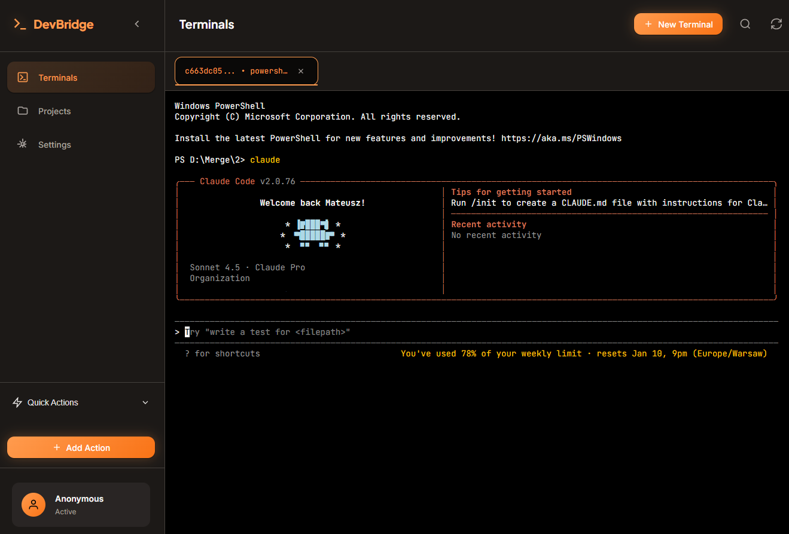

# DevBridge 🌉

> **Your Terminal Sessions, Everywhere**

DevBridge is a professional web-based terminal application that enables seamless session continuity across all your devices. Start a coding session on your desktop, continue it from your laptop at the office, and finish it from your tablet at home—all without losing context or interrupting your workflow.

Perfect for developers who work with AI CLI tools (Claude Code, Codex CLI, Google Gemini CLI) or need access to their development environment from anywhere. DevBridge maintains persistent terminal sessions that survive browser refreshes, device switches, and network interruptions, ensuring your work is always accessible when you need it.

**Key Benefits:**
- 🔄 **Session Continuity**: Start work on one device, seamlessly continue on another
- 🌍 **Remote Access**: Access your home/office development environment from anywhere in the world
- 💾 **Persistent Sessions**: Terminal sessions survive server restarts and browser closures
- 📱 **Multi-Platform**: Full-featured interface on desktop, tablet, and mobile devices
- 🚀 **Zero Setup**: No client installation required—just open your browser and continue working

[](https://www.python.org/downloads/)
[](https://fastapi.tiangolo.com)
[](https://opensource.org/licenses/MIT)
[](https://github.com/mateuszsury)
[](SECURITY.md)

---

## ✨ Features

### 🖥️ **Multi-Terminal Management**
- Create, manage, and switch between multiple terminal sessions
- Full xterm.js-powered terminal emulation with proper PTY support
- Session persistence - terminals survive page reloads
- Automatic session restoration on server restart (marked as "stale")
- Real-time terminal output via WebSockets
- Proper terminal resizing and window management

### 🚀 **AI CLI Integration**
- **Project Quick Launch**: Browse your projects and instantly open them with:
  - Claude Code (`claude`)
  - Codex CLI (`codex`)
  - Google Gemini CLI (`gemini`)
  - Or just a regular terminal
- **Smart Shell Detection**: Automatically uses PowerShell on Windows, Bash on Unix/Linux
- **Cross-Platform Command Syntax**: Automatically handles `&&` (Unix) vs `;` (PowerShell) differences

### ⚡ **Quick Actions**
- Create custom quick actions for common tasks
- Run commands in background with automatic notifications
- Visual feedback with toast notifications (success/error/info)
- Examples:
  - `docker compose restart`
  - `npm run build`
  - `git pull origin main`
  - Custom deployment scripts
- Organized in expandable sidebar with emoji icons
- 60-second timeout with automatic cleanup

### 📱 **Fully Responsive Design**
- **Desktop**: Collapsible sidebar, multi-column layouts, hover effects
- **Tablet**: Optimized layouts for medium screens
- **Mobile**:
  - Bottom navigation bar
  - Swipe gestures for tab switching
  - Virtual keyboard (Tab, Esc, Ctrl, arrows)
  - Touch-optimized buttons (44px minimum)
  - PWA support - install as a native app

### 🎨 **Beautiful UI**
- Claude-inspired warm color scheme (#FF9B4E orange)
- Smooth animations and micro-interactions
- Glass-morphism effects on modals and overlays
- Dark theme optimized for long coding sessions
- Custom fonts: Plus Jakarta Sans (UI) + JetBrains Mono (terminal)

### 👥 **User Management**
- Multi-user support with authentication
- Admin and regular user roles
- Bootstrap admin account on first run
- Anonymous mode option for single-user setups
- Session-based authentication with HTTP-only cookies

### ⚙️ **Configurable Settings**
- Authentication toggle (require login or allow anonymous)
- Max concurrent sessions limit
- Idle session timeout
- Scrollback buffer size
- Default shell configuration (Windows/Unix)
- Custom AI CLI command names

---

## 📸 Screenshot

### Desktop Interface

*Full-featured terminal interface with multi-session management and quick actions sidebar*


---

## 🔐 Security Warning

**⚠️ IMPORTANT: DevBridge has minimal built-in security and should NOT be exposed directly to the internet.**

### Recommended Security Setup:

1. **VPN Solution (Recommended)**
   ```bash
   # Use Tailscale for secure remote access
   curl -fsSL https://tailscale.com/install.sh | sh
   tailscale up

   # Access DevBridge via Tailscale IP only
   # http://100.x.x.x:8000
   ```

2. **Authentication Proxy**
   ```yaml
   # Use Authelia, Authentik, or similar
   # Example: Authelia in front of DevBridge
   services:
     authelia:
       image: authelia/authelia
       # ... configuration ...

     devbridge:
       image: devbridge
       # Only accessible via Authelia
   ```

3. **Reverse Proxy with SSL**
   ```nginx
   # Nginx with Let's Encrypt SSL
   server {
       listen 443 ssl http2;
       server_name devbridge.yourdomain.com;

       ssl_certificate /path/to/cert.pem;
       ssl_certificate_key /path/to/key.pem;

       location / {
           proxy_pass http://localhost:8000;
           proxy_http_version 1.1;
           proxy_set_header Upgrade $http_upgrade;
           proxy_set_header Connection "upgrade";
       }
   }
   ```

4. **Firewall Rules**
   ```bash
   # Only allow access from VPN or specific IPs
   ufw allow from 100.0.0.0/8 to any port 8000  # Tailscale
   ufw deny 8000
   ```

---

## 📦 Installation

### Prerequisites

- **Python 3.13+**
- **Windows**: `winpty` (automatically installed)
- **Unix/Linux**: Standard PTY support
- **Node.js** (optional, for development)

### Quick Start

1. **Clone the repository**
   ```bash
   git clone https://github.com/mateuszsury/devbridge.git
   cd devbridge
   ```

2. **Create virtual environment**
   ```bash
   python -m venv .venv

   # Windows
   .venv\Scripts\activate

   # Unix/Linux
   source .venv/bin/activate
   ```

3. **Install dependencies**
   ```bash
   pip install -r requirements.txt
   ```

4. **Configure environment** (optional)
   ```bash
   cp .env.example .env
   # Edit .env with your settings
   ```

5. **Run the application**
   ```bash
   # Development
   uvicorn webterm.main:app --reload --host 0.0.0.0 --port 8000

   # Production
   uvicorn webterm.main:app --host 127.0.0.1 --port 8000 --workers 4
   ```

6. **Access the application**
   ```
   http://localhost:8000

   Default admin credentials:
   Username: admin
   Password: admin

   ⚠️ CHANGE THESE IMMEDIATELY IN PRODUCTION!
   ```

### Docker Installation

```dockerfile
# Dockerfile example
FROM python:3.13-slim

WORKDIR /app

COPY requirements.txt .
RUN pip install --no-cache-dir -r requirements.txt

COPY . .

CMD ["uvicorn", "webterm.main:app", "--host", "0.0.0.0", "--port", "8000"]
```

```bash
# Build and run
docker build -t devbridge .
docker run -p 8000:8000 -v $(pwd)/data:/app/data devbridge
```

### Docker Compose with Tailscale

```yaml
services:
  tailscale:
    image: tailscale/tailscale:latest
    hostname: devbridge
    volumes:
      - tailscale-data:/var/lib/tailscale
    cap_add:
      - NET_ADMIN
      - NET_RAW
    environment:
      - TS_AUTHKEY=${TAILSCALE_AUTH_KEY}
      - TS_STATE_DIR=/var/lib/tailscale
    command: tailscaled

  devbridge:
    build: .
    network_mode: service:tailscale
    volumes:
      - ./data:/app/data
    depends_on:
      - tailscale

volumes:
  tailscale-data:
```

---

## 🎯 Use Cases

### 1. **Remote Coding from iPad/Phone**
```
Scenario: You're on vacation with just an iPad, but need to fix a bug.

Solution:
1. Open DevBridge on iPad browser
2. Navigate to Projects
3. Click "Claude" on your project
4. Continue exactly where you left off on your desktop
5. Claude Code runs on your home server, accessible via Tailscale
```

### 2. **Multiple Workstations**
```
Scenario: You work from home PC, office laptop, and occasionally a café.

Solution:
1. Install DevBridge on your home server
2. Set up Tailscale on all devices
3. Access the same terminal sessions from anywhere
4. Sessions persist between device switches
```

### 3. **Pair Programming**
```
Scenario: Remote pair programming session with a colleague.

Solution:
1. Share your Tailscale DevBridge URL
2. Both work in the same terminal session
3. Real-time synchronization via WebSocket
4. No screen sharing lag
```

### 4. **Automated Task Execution**
```
Scenario: Need to run regular maintenance tasks.

Solution:
1. Create Quick Actions for common tasks
2. One-click execution from anywhere
3. Get notifications on completion
4. Review output in browser console
```

---

## 🛠️ Configuration

### Environment Variables

Create a `.env` file in the project root:

```bash
# Database
DB_PATH=data/devbridge.db

# Admin Bootstrap (first run only)
BOOTSTRAP_ADMIN_USERNAME=admin
BOOTSTRAP_ADMIN_PASSWORD=admin

# Session Cookie
SESSION_COOKIE=devbridge_session
SECRET_KEY=your-secret-key-here-change-this

# Server
HOST=0.0.0.0
PORT=8000
```

### Application Settings (via UI)

**Authentication:**
- `auth_required`: Force login for all users
- `allow_anonymous_terminal`: Allow terminal creation without login

**Session Limits:**
- `max_sessions`: Maximum concurrent terminal sessions (default: 50)
- `idle_ttl_seconds`: Auto-kill idle sessions after N seconds (0 = disabled)

**Terminal:**
- `scrollback_limit_chars`: Maximum scrollback buffer size (default: 200,000)
- `default_unix_shell`: Shell for Unix/Linux (default: `/bin/bash`)
- `default_windows_shell`: Shell for Windows (default: `powershell.exe`)

**AI CLI Commands:**
- `claudeCommand`: Command to run Claude Code (default: `claude`)
- `codexCommand`: Command to run Copilot CLI (default: `codex`)
- `geminiCommand`: Command to run Gemini CLI (default: `gemini`)

---

## 🗂️ Project Structure

```
devbridge/
├── webterm/
│   ├── main.py              # FastAPI application
│   ├── db.py                # SQLite database operations
│   ├── security.py          # Authentication & authorization
│   ├── terminal_manager.py  # Terminal session management
│   ├── pty_windows.py       # Windows PTY implementation
│   ├── pty_unix.py          # Unix/Linux PTY implementation
│   ├── settings.py          # Environment configuration
│   └── static/
│       ├── app.js           # Frontend JavaScript
│       ├── styles.css       # UI styles
│       ├── xterm.js         # Terminal emulator
│       ├── manifest.json    # PWA manifest
│       └── sw.js            # Service worker
├── webterm_templates/
│   └── index.html           # Main HTML template
├── data/
│   └── devbridge.db         # SQLite database
├── requirements.txt         # Python dependencies
├── README.md               # This file
└── .env                    # Configuration (create from .env.example)
```

---

## 🚀 Quick Actions Examples

### Docker Management
```json
{
  "name": "Restart Docker",
  "command": "docker compose restart",
  "cwd": "C:\\projects\\my-app",
  "icon": "🐳",
  "color": "info"
}
```

### Git Operations
```json
{
  "name": "Pull Latest",
  "command": "git pull origin main",
  "cwd": "/home/user/project",
  "icon": "📥",
  "color": "success"
}
```

### Testing
```json
{
  "name": "Run Tests",
  "command": "npm test",
  "cwd": "C:\\dev\\webapp",
  "icon": "🧪",
  "color": "warning"
}
```

### Build & Deploy
```json
{
  "name": "Deploy Production",
  "command": "./deploy.sh production",
  "cwd": "/var/www/app",
  "icon": "🚀",
  "color": "danger"
}
```

---

## 📱 Progressive Web App (PWA)

DevBridge can be installed as a native app on mobile devices:

### iOS (Safari)
1. Open DevBridge in Safari
2. Tap the Share button
3. Tap "Add to Home Screen"
4. Tap "Add"

### Android (Chrome)
1. Open DevBridge in Chrome
2. Tap the menu (⋮)
3. Tap "Install app" or "Add to Home screen"

### Desktop (Chrome/Edge)
1. Open DevBridge
2. Look for install icon in address bar
3. Click "Install"

**Benefits:**
- Fullscreen mode without browser UI
- App icon on home screen/dock
- Offline-capable (UI assets cached)
- Faster load times

---

## 🐛 Troubleshooting

### Terminal Not Opening
```bash
# Check if port is available
netstat -ano | findstr :8000  # Windows
lsof -i :8000                  # Unix/Linux

# Check logs
uvicorn webterm.main:app --log-level debug
```

### WebSocket Connection Failed
```bash
# Ensure WebSocket support in reverse proxy
# Nginx example:
proxy_set_header Upgrade $http_upgrade;
proxy_set_header Connection "upgrade";
```

### Session Not Persisting
```bash
# Check database permissions
ls -la data/devbridge.db  # Unix/Linux
icacls data\devbridge.db  # Windows

# Ensure writable directory
chmod 755 data/           # Unix/Linux
```

### PTY Errors on Windows
```bash
# Install/reinstall winpty
pip uninstall pywinpty
pip install pywinpty
```

### Quick Action Timeout
```python
# Increase timeout in webterm/main.py
# Default is 60 seconds
stdout, stderr = await asyncio.wait_for(
    process.communicate(),
    timeout=120.0  # Increase to 120 seconds
)
```

---

## 🤝 Contributing

Contributions are welcome! Please follow these steps:

1. **Fork the repository**
2. **Create a feature branch**
   ```bash
   git checkout -b feature/amazing-feature
   ```
3. **Make your changes**
4. **Test thoroughly**
   - Desktop browsers (Chrome, Firefox, Safari, Edge)
   - Mobile browsers (iOS Safari, Android Chrome)
   - Different terminal sessions
5. **Commit with conventional commits**
   ```bash
   git commit -m "feat: add amazing feature"
   ```
6. **Push to your fork**
   ```bash
   git push origin feature/amazing-feature
   ```
7. **Open a Pull Request**

### Code Style
- Python: Follow PEP 8
- JavaScript: Use ES6+ features
- CSS: BEM-like naming conventions
- Comments: Explain "why", not "what"

---

## 📄 License

This project is licensed under the MIT License - see the [LICENSE](LICENSE) file for details.

---

## 🙏 Acknowledgments

- **[xterm.js](https://xtermjs.org/)** - Excellent terminal emulator
- **[FastAPI](https://fastapi.tiangolo.com/)** - Modern Python web framework
- **[Tailscale](https://tailscale.com/)** - Zero-config VPN
- **[Claude](https://www.anthropic.com/claude)** - AI pair programming
- **Anthropic** - For inspiration on beautiful, warm UI design

---

## 🗺️ Roadmap

- [ ] **Terminal Themes**: Multiple color schemes (Dracula, Solarized, etc.)
- [ ] **File Upload/Download**: Transfer files via terminal
- [ ] **Collaborative Sessions**: Multi-user terminal sharing with cursors
- [ ] **Session Recording**: Record and replay terminal sessions
- [ ] **SSH Integration**: Connect to remote servers
- [ ] **Kubernetes Integration**: Exec into pods
- [ ] **Docker Integration**: Attach to containers
- [ ] **Terminal Tabs**: Split terminal view
- [ ] **Command History Search**: Global command search across sessions
- [ ] **AI Assistant Integration**: Built-in AI chat sidebar

---

## ⭐ Star History

If you find DevBridge useful, please consider starring the repository!

---

**Made with ❤️ for developers who code from anywhere**

*Continue your AI coding sessions seamlessly across all your devices* 🌉
